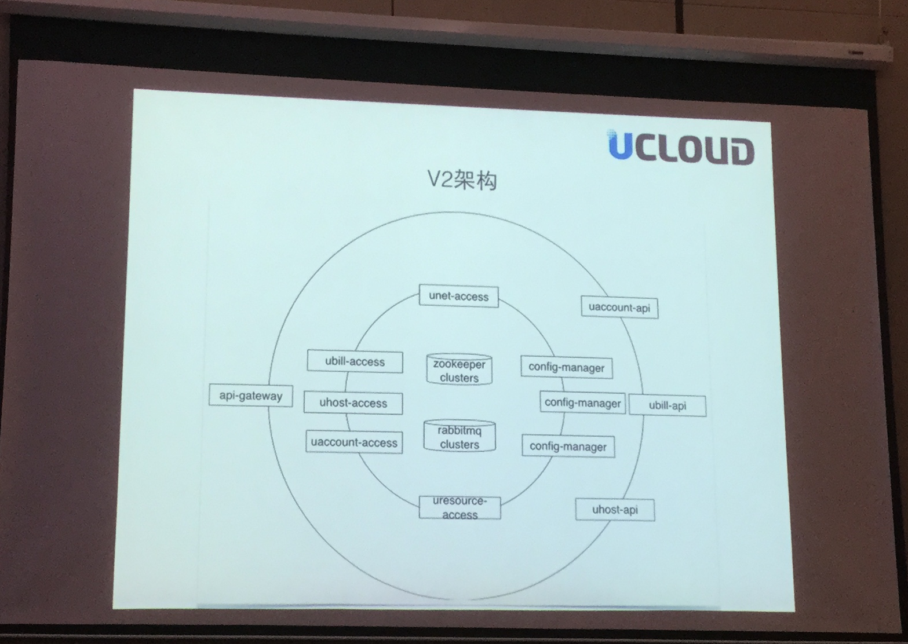

# jsconf #shenjs2015 参会小结与交流

刘敬威 [@th507](https://twitter.com/th507), Meituan
---
<div class="title">
  <h1>Schedule</h1>
</div>
<div class="schedule wrapper">
  <div class="list day1">
    <h2>7/11</h2>
    <ul>
      <li>
        <time>09:45</time>
        <div>
          <h4>Database Everywhere: a Reactive Data Architecture for JavaScript Frontends
</h4>
          <p>Evan You</p>
        </div>
      </li>
      <li>
        <time>10:15</time>
        <div>
          <h4>Unlimited Power – ES6 Generators</h4>
          <p>Brian Holt</p>
        </div>
      </li>
      <li>
        <time>11:00</time>
        <div>
          <h4>How koa and toa work &amp; use them in real world</h4>
          <p>Qing Yan</p>
        </div>
      </li>
      <li>
        <time>11:30</time>
        <div>
          <h4>My attempt to use Angular.js for a real-time application</h4>
          <p>Bohan li</p>
        </div>
      </li>
      <li>
        <time>13:30</time>
        <div>
          <h4>PM2 and Keymetrics.io</h4>
          <p>Alexandre Strzelewicz</p>
        </div>
      </li>
      <li>
        <time>14:00</time>
        <div>
          <h4>Nodebot session introduction</h4>
          <p>Andrew Fisher</p>
        </div>
      </li>
      <li>
        <time>15:20</time>
        <div>
          <h4>How to build a distributed system with Node.js</h4>
          <p>Tianle Wen</p>
        </div>
      </li>
      <li>
        <time>15:50</time>
        <div>
          <h4>The Rise and Fall of JS Frameworks</h4>
          <p>Eyal Arubas</p>
        </div>
      </li>
      <li>
        <time>16:30</time>
        <div>
          <h4>The infinite imaginative data visulization in front-end</h4>
          <p>Yi Shen</p>
        </div>
      </li>
      <li>
        <time>17:00</time>
        <div>
          <h4>NERD DISCO: The Next Generation
</h4>
          <p>Tim Pietrusky</p>
        </div>
      </li>
      <li>
        <time>19:00</time>
        <div>
          <h4>Nodebot Session</h4>
          <p>Andrew Fisher</p>
        </div>
      </li>
    </ul>
  </div>
  <div class="list day2">
    <h2>7/12</h2>
    <ul>
      <li>
        <time>09:15</time>
        <div>
          <h4>Frontend test in Qiniu</h4>
          <p>Yiqing Ma</p>
        </div>
      </li>
      <li>
        <time>09:45</time>
        <div>
          <h4>The optimized tool: node profiler
</h4>
          <p>Jackson Tian</p>
        </div>
      </li>
      <li>
        <time>10:30</time>
        <div>
          <h4>p2p pipes</h4>
          <p>Mathias Buus</p>
        </div>
      </li>
      <li>
        <time>11:00</time>
        <div>
          <h4>Dispatch service under micro service structure</h4>
          <p>Zongmin Lei</p>
        </div>
      </li>
      <li>
        <time>11:30</time>
        <div>
          <h4>The road to isomorphic web development</h4>
          <p>Hermen</p>
        </div>
      </li>
      <li>
        <time>13:30</time>
        <div>
          <h4>JavaScript: The World's Best Programming Language
</h4>
          <p>Hax</p>
        </div>
      </li>
      <li>
        <time>14:00</time>
        <div>
          <h4>How fibjs works and how we use it in baoz.cn</h4>
          <p>Hengfei Zhuang</p>
        </div>
      </li>
      <li>
        <time>15:20</time>
        <div>
          <h4>Persistent data structure in JS land: implementing immutable frontend using react.js
</h4>
          <p>Yue Ni</p>
        </div>
      </li>
      <li>
        <time>15:50</time>
        <div>
          <h4>How to build an online IDE with React</h4>
          <p>Hui Liu</p>
        </div>
      </li>
      <li>
        <time>16:30</time>
        <div>
          <h4>Diving in - WebGL and WebVR</h4>
          <p>Martin Naumann</p>
        </div>
      </li>
      <li>
        <time>17:00</time>
        <div>
          <h4>Maintainable Node.js</h4>
          <p>dead-horse</p>
        </div>
      </li>
    </ul>
  </div>
</div>
---

# Database Everywhere: a Reactive Data Architecture for JavaScript Frontends

演讲者是 Meteor.js 的开发者

维护 client state 到 server state (数据库) 的“双向绑定”。

传统的系统分层大概是这样的

```

前端的界面渲染 1
                    <-- 前端关注的双向绑定
前端数据和逻辑 2
                    <-- C/S 的分界
业务层 3
                    <-- 后端的业务分界
底层数据库或数据服务 4

```

1、2 是传统数据双向绑定的关注界限

但 meteor 解决了 2 - 3 甚至 2 - 4 的通讯机制。看上去是前端直连数据库的做法，其实内部是有分层的。

这个在 QA 环节有人问过，在本地有一个 minimongo 数据库，然后 meteor 保持 minimongo 和服务器端数据的同步。

[slide](http://slides.com/evanyou/shenjs#/)
---

# Unlimited Power – ES6 Generators

Netflix 出品。讲了 yield 的一些使用方法。

和一般的认识不同 yield 不光可以作为输出，还可以作为输入。

作为输入的例子可以参见我之前写的 [gist](https://gist.github.com/th507/626664612a1ae9893589)

实现类似 `function* () {setTimeout(yield, 100)}` 的懒执行

---

# koa 和 toa 的框架原理及开发实践

把 koa 的洋葱模型换成了类似 express 的线性模型。

[slide](http://www.zensh.org/slides/2015toakoa/index.html)

---

# 用Angular.js做实时应用的一次实践

主要是一些实际的坑

---

# PM2 and Keymetrics.io
PM2 公司 founder 出来讲的。Keymetrics 的广告。

后续找机会和他仔细聊了一下：

- pm2 启动卡死的请升级到最新版，他们最近做了很多这方面的工作
- 超内存重启失败的请检查直接运行 `pm2 reload` 是否可以正常启动
- [Graceful reload 使用时候应该加上这一段](https://github.com/Unitech/PM2/blob/master/ADVANCED_README.md#graceful-reload)
- 授权模式方面，没有考虑类似 stash 的授权模式，数据必须发送到他们管理的 server farm 上
- 会推出类似 dedicated vps 的产品，做好数据隔离和备份，但属于 premium 服务，价格更贵
- 给他介绍了一下我们做的 pm2.5

---

 
 
# Nodebot session introduction

Node + Arduino + Firmata Protocol + 四驱赛车


把驱动封装成一个 npm package，然后可以通过编程控制。基于 [johnny-five](https://github.com/rwaldron/johnny-five)

---

# 如何构建配置集中管理且自动调度的应用集群
Redis + ZK 的半集中架构
	

---

# The Rise and Fall of JS Frameworks
Eyal Arubas (Pearson/EF 培生/英孚教育，lwip 作者)
Eyal 的个人判断：未来应该侧重于整合中小型技术，不建 walled garden。前段开发的基础架构逐步成熟，整合技术的难度逐渐降低，维护一套自己独有的技术不再是必须的事情。

这种思路适合中小型团队。

---

# 前端技术在数据可视化领域的无限畅想

demo 了一下百度的一些数据可视化成果：
基于 Canvas/WebGL 的数据可视化和优化


---

# NERD DISCO: The Next Generation

用 WebAudio 提取乐曲信息，做 visualizer。再整合工控，可以直接控制 LED

---

# 七牛前端测试实践
karma + phantomjs + karma-coverage

---

# 调优利器：node profiler

没有讲单型等、主要讲了一些通过 profile v8/node 底层达到的性能优化。

深入 v8 做了一个 profiler，做了图形化的界面。

[profiler](http://alinode.aliyun.com/)
[slide](https://github.com/JacksonTian/shenjs)

---

# p2p pipes

对 Stream 调用的抽象。可以在几乎任何协议 (tcp, udp, bluetooth, bash, …) 上跑的 p2p 传输。

[slide](https://github.com/mafintosh/slides/tree/gh-pages/jsconf-china-2015)

---

# 微服务架构下的服务通讯

山寨了 Erlang

---

# 前端服务化之路

服务化的组件：独立打包、独立管理资源加载、以 web-component 的形式使用，可以接入任何的外部框架。和 angular，react 不同，侵入性小。可能适合中小团队。

---

# JavaScript: The World's Best Programming Language

不是很严谨，但对基本面的判断还是比较清晰的。因为 JS 足够快、运行环境普及、学习成本偏低、生态比较理想。所以在很长时间都会是前段乃至更广泛领域的主力语言。

---


# fibjs原理以及在孢子社区的实践

从底层解决了异步调用的问题，但引发了更多的问题

fib 改写了 v8 底部的 platform 层，建立了一个基于协程运行环境的 platform 层，执行任务时会开多个 v8 执行，然后做内存拷贝到主线程，所以 `instanceof` 之类的代码全挂。


---


# Persistent data structure in JS land: implementing immutable frontend using react.js

Persistent data structure, copy on write, 增量更新算法等

集中在算法和实现上面

---

# 使用 React 构建在线 IDE 的应用实践

一些实际使用中 react 顺手的点，比如配置更改之后如何通知所有打开的编辑器窗口

---


# Diving in - WebGL and WebVR

JS 也可以实现 Oculus Rift 一样的效果，但从现场demo来看性能稍差

http://avgp.github.io/shenjs-3d/#13

---


# Maintainable Node.js

讲了一些 node 和 koa 开发的坑

---

# 总结
这次 jsonf 看下来。js 开发者现在在各个领域都开始有所作为。出了传统的前端和衍生出来的可视化之外。还有一些新鲜的方向

- node: 从梳理前端职责范围到全栈开发
- webgl, webvr, webaudio: 现在前端有了更底层的一些 API，可以以较低成本进行富交互环境的开发。虚拟现实和 gamification 都会考虑（部分）使用 js 完成原型的开发和探索。
- 可编程的硬件设备: 本来是一个技术门槛比较高的领域，现在高级玩具都引入了可编程的硬件设备，基于开源的 firmware 协议和 arduino。硬件的可编程性大幅提高了，而 node 进一步降低了这个门槛和硬件配置要求。


传统的前端开发领域

- 组件化是项目规模扩大后的一个产物，大家都在做，各家方案不同
- promise 普及了
- react 是目前比较热门的前端组件化方案，但用 angular 的人也不少
- koa 开始在国内普及，但普遍水平一般

另外

- coffee 还有人用

---

# 完


